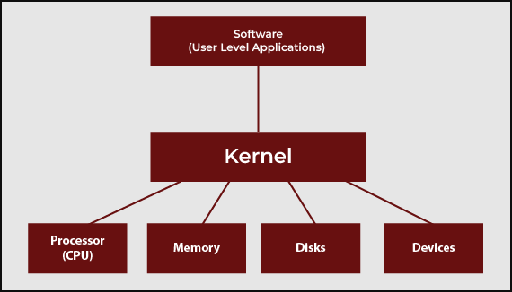
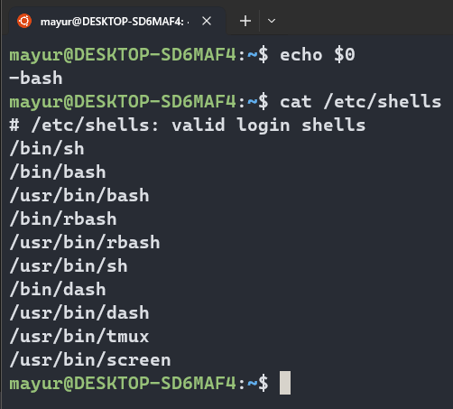
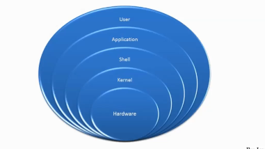
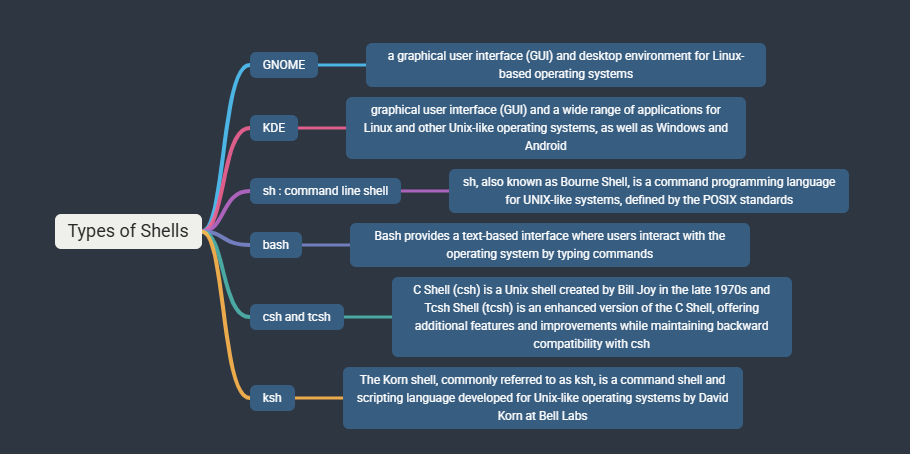
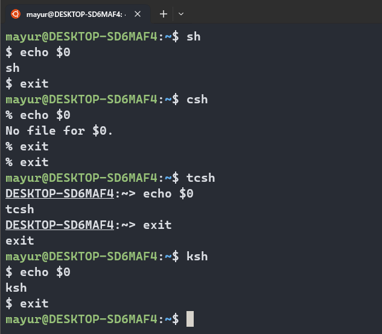
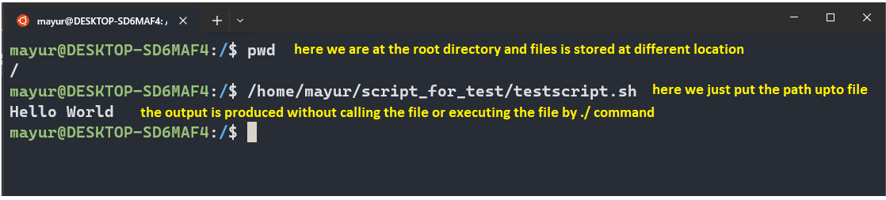
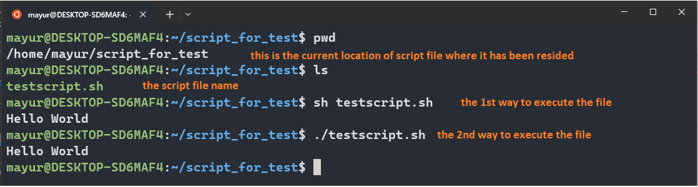

# What is Kernel?

1. Interfaces between hardware and software.
2. Kernel is a program that stored inside your operating system.
3. It takes the command from Shell. (Shell is User Interface in Linux or Terminal in Linux)
4. Shell and Kerel operating together software bundled into one package is called as an operating system.

# What is Shell?

1. It's like a container
2. Interface between users and Kernel/OS
3. CLI is a shell

## How to find your shell?

1. echo $0
2. Available shells, cat /etc/shells
3. your shell? that is also defined inside the /etc/passwd

4. In windows GUI is a shell
5. Linux KDE GUI is a shell
6. Linux sh,bash etc. is a shell

## What is shell scripting?

1. We put instructions in a shell and run it or execute it

## Types of Linux Shell

## How to start a shell?

1. Simply type the shell names

# How to Run a Shell Script?

1. By using Absolute path: you have to manually type the whole absolute path where the your script is located and then just enter, therefore, shell will take care of it and execute the respective script

2. By using Reference path: you have to go to the file location by using change directory command where your script file is located and then after reaching into the relative path you have to execute the file by using command like
   sh <script_file_name>.sh
   or ./<script_file_name>

